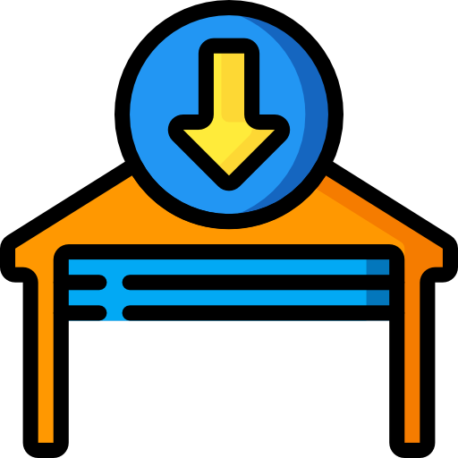

# Auto Close Garage Doors

This SmartThings SmartApp enables you to set up your doors to automatically close
after a period of being open. It has an optional setting to disable closing
in a specific mode.

For example, create a "Party" mode for your "Home" Location, and select this mode
in the app. Now, when your "Home" Location is in "Party" mode, doors will not
automatically close.

## Alexa Integration

Alexa will not control any devices or routines which directly interface with doors.

To integrate with Alexa, create a Routine in the SmartThings app which changes the Mode to one of your disabled modes, and another Routine to change your mode back.

For example:

1. Set up Auto Close Garage Doors to auto close your garage door, disabled in Workshop Mode.
2. Create a Routine called "Working in the Garage" which sets the Mode to "Workshop"
3. Create a second Routine called "Done Working in the Garage" which sets the Mode to "Home"
3. Refresh the Alexa SmartApp to pick up the new routines.
4. Say "Alexa, turn on Working in the Garage"
5. Now, when you open your garage door, it will not automatically close.
6. Say "Alexa, turn on Done Working in the Garage" and close your door.
7. Now, when you open your door, it will auto close after your configured delay.

License MIT,

Inspired by my own desire to have auto closing doors but not all the time.

Code adapted from https://community.smartthings.com/t/auto-lock-door-only/82418

Icon made by [Creaticca Creative Agency](https://www.flaticon.com/authors/creaticca-creative-agency) from [www.flaticon.com](https://www.flaticon.com/) is licensed by [CC 3.0 BY](http://creativecommons.org/licenses/by/3.0/)
